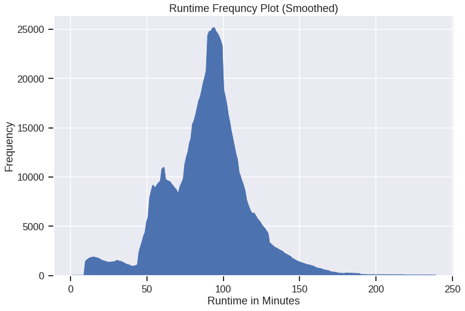
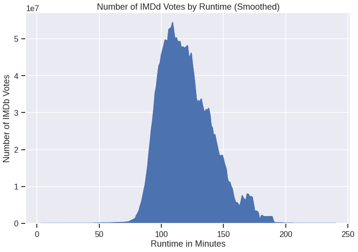
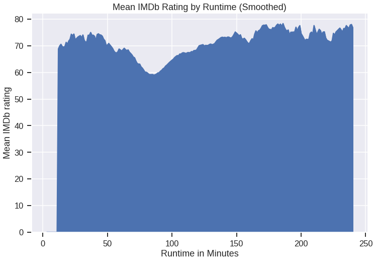
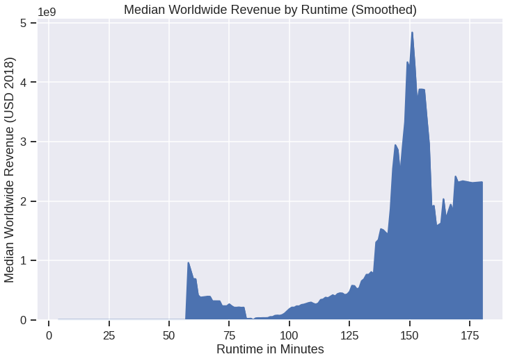

# Movie Market Analysis

In this project we analyze the relationship between movie runtime and several
key business metrics.

## Non-technical presentation
For a non-technical presentation of our findings please see the slide deck and video presentation below.
* <a href='./presentation/presentation.pdf'>Slide Deck</a>
* <a href='https://youtu.be/ND-BXQqCP7c'>Video Presentation</a>

## Data cleaning
Data was provided in the form of gzipped csv and tsv files which are located in the <a href='./zippedData'>zippedData</a> folder. We processed data from the following files:
* `imdb.title.basics.csv.gz`
* `imdb.title.ratings.csv.gz`
* `tn.movie_budgets.csv.gz`
* `imdb.name.basics.csv.gz`
* `imdb.title.principals.csv.gz`

We wrote a library called `moviesdb` located <a href = './notebooks/moviesdb/moviesdb.py'>here</a> which provides classes  with methods to load data from the files above into a sqlite database. The library also provides a helper class called `MoviesDb` which provides methods for interacting with the database. 

If the database is not already present, the script <a href='./notebooks/makeMoviesDb.py'>makeMoviesDb.py</a> will build the database from the provided files.

### Data transformations
While most of the data was formatted appropriately, there were a few variables that required special attention. We highlight these variables below organized by input file.

#### `imdb.title.basics.csv.gz`
* To ensure that the `start_year` and `runtime_minutes` variables were read into the database as integers we explicitly converted them to integers.
* We converted the `genres` variable to distinct indicator variables for each genre. This was achieved by setting a default values of `0` in the genre indicator variables housed in the `genres` database table and writing `1` to each indicator variable that matched with the input `genres` string. This is implemented by the method `_TitleBasicsParser.get_row_dict_genre`.

#### `imdb.title.ratings.csv.gz`
* To ensure the appropriate data type we explicitly convert the `averagerating` variable to a float and convert the `numvotes` variable to an integer. 

####  `tn.movie_budgets.csv.gz`
* In order to provide a viable foreign key to join with IMDb tables, we converted `release_date` to an integer year and stored it as `start_year`. With `start_year` included in the `budgets` table we can safely join with the `titles` table on `(primary_title, start_year)` to access the IMDb primary key 'tconst' which then provides safe joining with all other IMDb data.
* All of the variables `production_budget`, `domestic_gross`, and `worldwid_gross` needed to have `$` and commas stripped and to be convered to integers.

#### `title.principals.csv.gz`
* The `ordering` variable was explicitly converted to an integer to ensure that the correct data type was stored.

## Questions answered
The questions below are answered in separate notebooks.

### Question 1: What was the most common runtime?
Question notebook is located <a href='./notebooks/Question1.ipynb'>Here</a>

### Question 2: Which runtime produced the most ratings on IMDb?
Question notebook is located <a href='./notebooks/Question2.ipynb'>Here</a>

### Question 3: Which runtime produced the highest IMDb ratings?
Question notebook is located <a href='./notebooks/Question3.ipynb'>Here</a>

### Question 4: Which runtime produced the highest revenue?
Question notebook is located <a href='./notebooks/Question4.ipynb'>Here</a>

